# cubit
A Maya plugin for simulation of soft-body deformation and fracture, in real-time.* _cubit_ works by creating a voxelized version of an input mesh and using the voxels as deformation lattices for the vertices within. The simulation itself is based on Position Based Dynamics (PBD), using special voxelized gram-schmidt (VGS) constraints both within and between voxels to achieve both deformation and fracture. The technique originates from [this paper](https://web.ics.purdue.edu/~tmcgraw/papers/voxel_2025.pdf) by Tim McGraw and Xinyi Zhou.

The magic of _this_ plugin is that it gives users the ability to customize the simulation weights and constraints via custom painting and selection tools.

___

*Real-time in Maya? What's the point? That's a fair question - I see this plugin as a step in a (currently incomplete) pipeline. Prepare the mesh in Maya, using this plugin to paint simulation weights and constraints onto the mesh, and quickly visualize the results. Then export the mesh and the weights + constraints to a game engine (where real-time actually matters), and run the simulation in-game with a corresponding engine plugin. Of course, I think it's totally valid to use this in animation as well, you just may get better mileage out of other non-real-time techniques.

# Contents
- [Installing the plugin](#installing-the-plugin)
  - [Installation requirements](#installation-requirements)
  - [Installation steps](#installation-steps)
- [Basic usage](#basic-usage)
  - [Input mesh requirements](#input-mesh-requirements)
  - [Voxelize the mesh](#voxelize-the-mesh)
  - [Voxelizer options](#voxelizer-options)
  - [Mesh-specific simulation settings](#mesh-specific-simulation-settings)
- [Painting simulation weights](#painting-simulation-weights)
  - [Selecting and hiding](#selecting-and-hiding)
  - [Particle mass](#particle-mass)
  - [Face-to-face strain limits](#face-to-face-strain-limits)
  - [Paint tool settings](#paint-tool-settings)
- [Real-time simulation interaction](#real-time-simulation-interaction)
  - [Drag tool settings](#drag-tool-settings)
- [Adding primitive colliders](#adding-primitive-colliders)
- [Global simulation settings](#global-simulation-settings)
- [Roadmap](#roadmap)
- [Developing the plug-in](#developing-the-plug-in)
  - [Development requirements](#development-requirements)
- [License](#license)

# Installing the plugin

### Installation requirements

- Windows OS (for DirectX11 + Maya Viewport 2.0)
- Maya 2025+ (may work in lower versions but only tested in Maya 2025)

### Installation steps

- Download the `.mll` file and put it in your plugin directory. Then load it up from Maya's plugin manager (Windows > Settings and Preferences > Plug-in Manager). If you don't know your plugin directory path, look at the plug-in manager for examples.
- Ensure the `dx11Shader.mll` plugin is loaded in the plugin manager.
- Enable Viewport 2.0 with DirectX11: `Windows > Settings/Preferences > Preferences > Display > Viewport 2.0 > DirectX 11` (this may require a Maya restart).

In the future, I hope to make this available for download directly through the Maya plugin app store.

# Basic usage

### Input mesh requirements
- The input mesh must be a single, manifold, non-self-intersecting, water-tight mesh.
- If voxelization fails on one of these counts, try using Maya's mesh clean up tools, merging vertices, or using boolean operations to join mesh pieces.

###  Voxelize the mesh

After loading the plugin, select your input mesh. Then, from the _cubit_ menu shelf, click the left-most button to open the voxelizer menu. Choose your voxelization options (see details below), the click voxelize to prepare the mesh. That's it! The mesh will now simulate on playback - though you may want to customize its behavior with some of the other tools that ship with this plugin.

### Voxelizer Options

#### Voxel Grid
1. The voxel size changes the edge length of a voxel. Voxels are always cubes.
1. The sliders can be used to change the subdivision resolution of the voxelization grid.
1. The checkbox "Lock grid size" will attempt to maintain the world size of the grid. So changing either voxel size or the subdivision sliders while this is checked will force the other to change. Because voxels must be cubes, this is a best-effort process.

#### Advanced Options

1. **Surface**: check this box to voxelize and simulate a surface shell of the input mesh.
1. **Solid**: check this box to voxelize and simulate the interior of the mesh. (Checking both surface and solid yields a full, conservative voxelization. This is the default behavior).
1. **Render as voxels**: when unchecked, the original mesh is drawn, but it is simulated according to its voxelization. When checked, the voxels are drawn instead of the original mesh.
1. **Clip triangles**: whether or not to clip the mesh's triangles to voxel bounds during voxelization. Unclipped triangles give a nice effect when tearing a mesh. Clipped tend to look better during regular deformation.

### Mesh-specific Simulation Settings

Open this menu by opening the Attribute Editor (`Windows > General Editor > Attribute Editor`), and finding the mesh's PBD node.

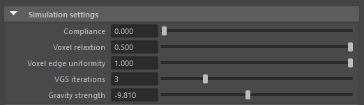

1. **Compliance**: this controls the overall squishiness of the mesh. A value of zero is the stiffest it gets!
1. **Voxel relaxation**: this value also has an effect on the squishiness of the mesh, to a lesser extent. As relaxation decreases, the mesh will deform more due to shear.
1. **Voxel edge uniformity**: a companion to voxel relaxation, this controls how strictly voxels have to stay cubes during deformation. As edge uniformity decreases, the mesh deforms more due to voxel anisotropy.
1. **VGS iterations** the number of substeps run in the VGS algorithm core loop. For high resolution voxelizations, more substeps may be required to get convergence. (Careful! This has a high performance impact).
1. **Gravity strength**: the gravitational acceleration constant in m/s^2

# Painting simulation weights

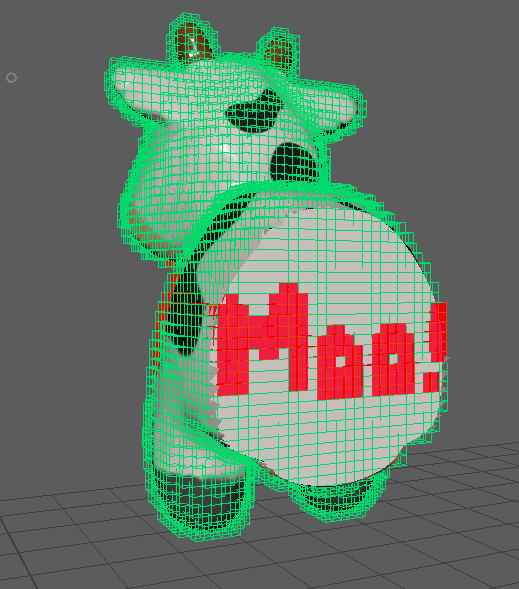

Beyond the per-mesh simulation settings mentioned [above](#mesh-specific-simulation-settings), there are also dials that can be tuned on a more granular level.

_cubit_ ships with custom tools that allow you to paint on the mass of the mesh and also the strain limits between voxel faces: that is, how much a voxel can stretch or compress before breaking from its neighbors.

## 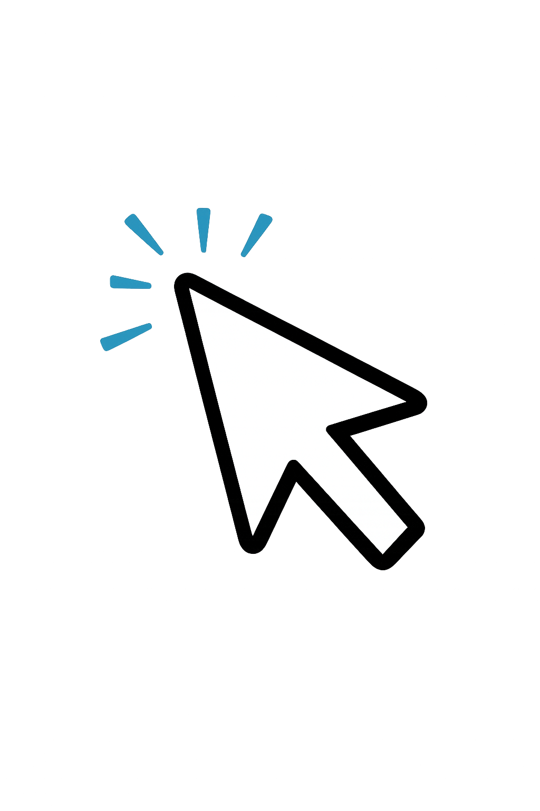 Selecting and hiding

Much of the time, the pieces of the mesh you want to paint are on the _inside_. After all, these simulated meshes are solid, and meant to be destroyed. To be able to paint weights on the mesh interior, you need to be able to _access_ it. That's where the select tool comes in handy:

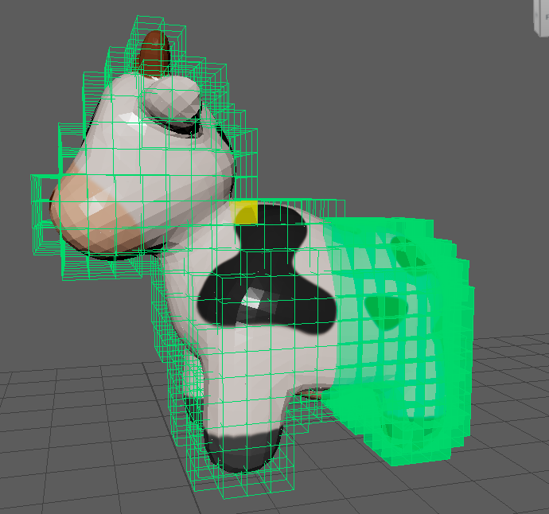

With the voxel selection tool, you can use the typical marquee or drag selection workflows (camera-based or not) to highlight and hide individual voxels - and the pieces of the mesh within.

## 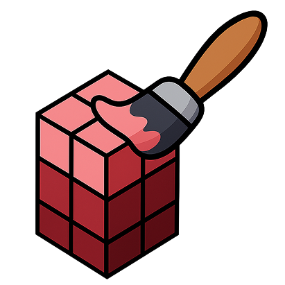 Particle mass

In each voxel, there are 8 particles: these are the simulation primitives in PBD. To set the mass of the mesh, you set the mass of particles. The particle paint tool allows you to do just this. 

In the below image, Spot the cow has the particles in his head painted to be a quarter of the mass of the particles in his body. The paint colors have been chosen so that higher transparency means less mass:

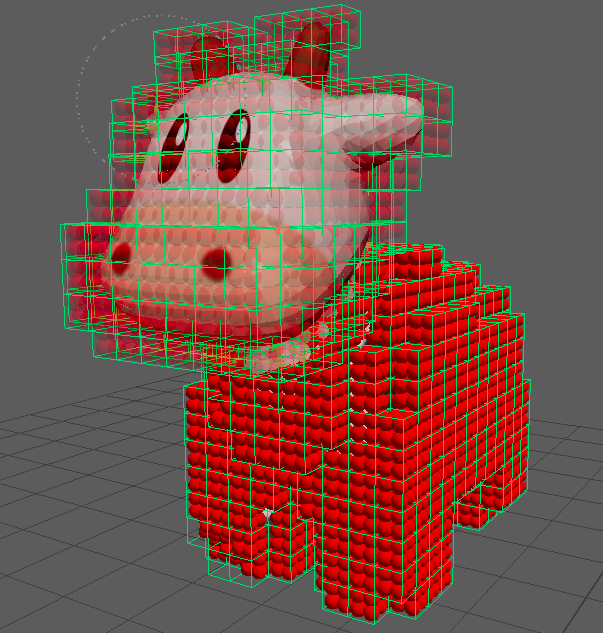

If we simulated spot like this, he would be bottom heavy. If we tossed him around, he would rotate about his lower body (his center of mass, rather than his geometric center). And if we collided him with another mesh of lower mass, he wouldn't lose much velocity!

The paint tool also exposes a special _infinite mass_ value: particles with infinite mass are pinned, even under gravity. This can be useful for anchoring a mesh in place while you have other actors deform or destroy it.

For more info about tool settings, see the [paint tool settings section](#paint-tool-settings) below.

##  Face-to-face strain limits

A similar painting tool exists for setting the face-to-face strain limits between voxels. This tool allows you to set how much the voxels can compress or stretch apart before breaking apart from their neighbors.

Like with particle mass, there's also a special _infinite strain_ value that makes face-to-face connections completely unbreakable.

### Paint tool settings

Open this menu by navigating to `Windows > General Editors > Tool Settings` after activating the paint tool from the _cubit_ shelf (or from the mesh's right-click marking menu).

#### Global settings

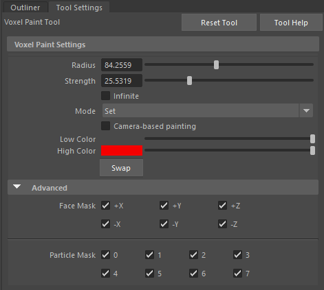

- **Radius**: the size of the brush, in pixels.
- **Strength**: the paint value, a p.ercentage of the values set on the PBD node (see mesh-specific settings below).
- **Infinite**: whether to use the special infinite paint value (ignores strength).
- **Mode**: the paint mode; `Set` directly applies the given paint strength to the mesh where painted. `Add` adds the existing paint strength with the brush strength, `Subtract` subtracts it.
- **Camera-based painting**: whether or not to paint only elements visible to the camera. When disables, anything and everything under the brush gets paint applied.
- **Low color**: the color to use as the low end of a gradient, when the paint value is 0.
- **High color**: the color to use as the high end of a gradient, when the paint value is 100.
- **Face mask**: limits face constraint painting to given local-space directions
- **Particle mask**: limits particle painting to a subset of the 8 particles per voxel.

#### Mesh-specific settings

Open this menu by opening the Attribute Editor (`Windows > General Editor > Attribute Editor`), and finding the mesh's PBD node.

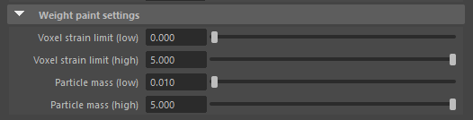

On each mesh's PBD node, in Maya's Attribute Editor, there are settings that give meaning to "Paint strength." This is best explained by example: in the above image, `Particle mass (low): 0.01` means that a paint strength of 0 corresponds to a particle mass of 0.01. A paint strength of 100 corresponds to a mass of 5, and anything in between is a linear interpolation of the two.

This way, the global paint settings can stay constant while meaning different things for different meshes, and the paint colors stay meaningful.

# 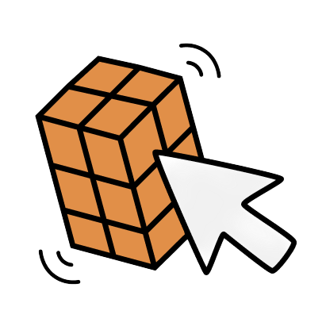 Real-time simulation interaction

With _cubit_, you can interact with the simulated mesh _in the viewport_, during playback. Click-and-drag the mesh with the voxel drag tool to pull, tear, and launch mesh voxels.

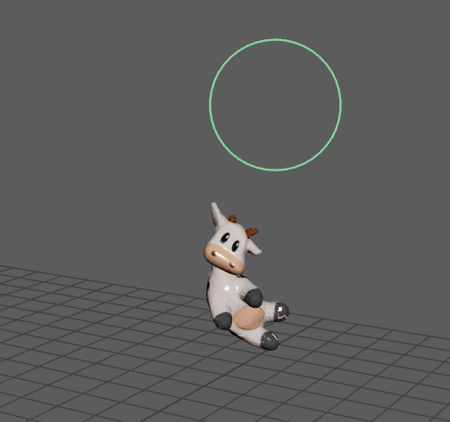

### Drag tool settings

Open this menu by navigating to `Windows > General Editors > Tool Settings` after activating the drag tool from the _cubit_ shelf (or from the mesh's right-click marking menu).

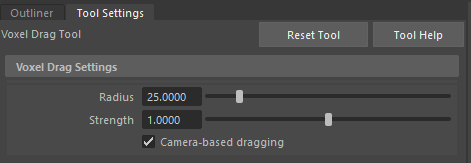

1. **Radius**: the size, in pixels, of the drag tool's influence from the mouse.
1. **Strength**: how far voxels get dragged relative to the mouse's movement. A factor of 1 means voxels get dragged exactly as much as the mouse moves.
1. **Camera-based**: whether or not the mouse can drag voxels that are not visible.

# Developing the plug-in

### Development requirements
- vcpkg: (clone from https://github.com/microsoft/vcpkg.git , go to the directory, and run the bootstrap: .\bootstrap-vcpkg.bat)
- Environment variables: 
  - `MAYA_PLUGIN_DIR` set to a directory where Maya finds plugins. There are several (run `getenv MAYA_PLUG_IN_PATH` in MEL command line or open the plug-in manager). Ideally, choose one that doesn't require admin privelege. 
  - `VCPKG_ROOT` set to the installation directory of `vcpkg`.
 - Dependencies listed in `vcpkg.json` and will be downloaded automatically on initial build.

Debug configuration: builds dependencies as DLLs and puts them alongside the plugin `.mll` in the specified maya plugin directory. Building as DLLs reduces the build time.

Release configuration: builds dependencies as static libs. Slower to build, but easier to distribute / consume. Release builds, of course, will run much faster as well.

# License

This project uses the CGAL (Computational Geometry Algorithms Library).

CGAL is licensed under the GNU General Public License (GPL).
See https://www.cgal.org/license.html for details.

If you distribute this software, you must comply with the terms of the GPL.