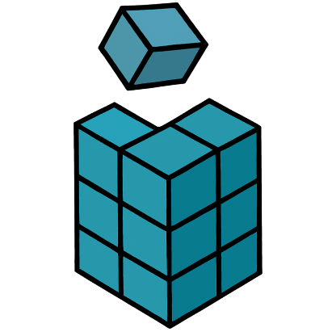
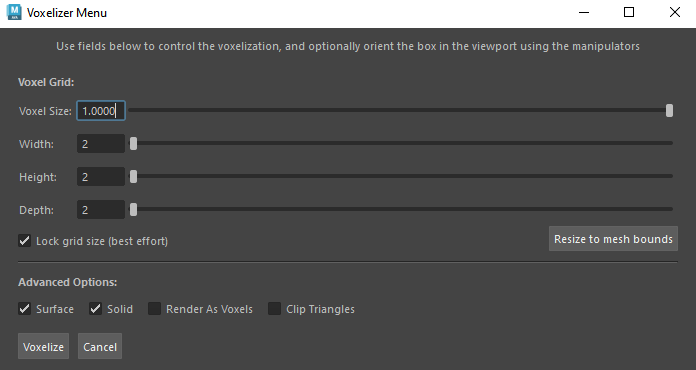

# cubit
A Maya plugin for simulation of soft-body deformation and fracture, in real-time.* cubit works by creating a voxelized version of an input mesh and using the voxels as deformation lattices for the vertices within. The simulation itself is based on Position Based Dynamics (PBD), using special voxelized gram-schmidt (VGS) constraints both within and between voxels to achieve both deformation and fracture. The technique originates from [this paper](https://web.ics.purdue.edu/~tmcgraw/papers/voxel_2025.pdf) by Tim McGraw and Xinyi Zhou.

The magic of _this_ plugin is that it gives users the ability to customize the simulation weights and constraints via custom painting and selection tools.

___

*Real-time in Maya? What's the point? That's a fair question - I see this plugin as a step in a (currently incomplete) pipeline. Prepare the mesh in Maya, using this plugin to paint simulation weights and constraints onto the mesh, and quickly visualize the results. Then export the mesh and the weights + constraints to a game engine (where real-time actually matters), and run the simulation in-game with a corresponding engine plugin. Of course, I think it's totally valid to use this in animation as well, you just may get better mileage out of other non-real-time techniques.

# Contents
- [Installing the plugin](#installing-the-plugin)
  - [Installation requirements](#installation-requirements)
  - [Installation steps](#installation-steps)
- [Basic usage](#basic-usage)
  - [Input mesh requirements](#input-mesh-requirements)
  - [Voxelize the mesh](#voxelize-the-mesh)
  - [Voxelizer options](#voxelizer-options)
- [Developing the plug-in](#developing-the-plug-in)
  - [Development requirements](#development-requirements)
- [License](#license)

# Installing the plugin

### Installation requirements

- Windows OS (for DirectX11 + Maya Viewport 2.0)
- Maya 2025+ (may work in lower versions but only tested in Maya 2025)

### Installation steps

- Download the `.mll` file and put it in your plugin directory. Then load it up from Maya's plugin manager (Windows > Settings and Preferences > Plug-in Manager). If you don't know your plugin directory path, look at the plug-in manager for examples.
- Ensure the `dx11Shader.mll` plugin is loaded in the plugin manager.
- Enable Viewport 2.0 with DirectX11: `Windows > Settings/Preferences > Preferences > Display > Viewport 2.0 > DirectX 11` (this may require a Maya restart).

In the future, I hope to make this available for download directly through the Maya plugin app store.

# Basic usage

### Input mesh requirements
- The input mesh must be a single, manifold, non-self-intersecting, water-tight mesh.
- If voxelization fails on one of these counts, try using Maya's mesh clean up tools, merging vertices, or using boolean operations to join mesh pieces.

###  Voxelize the mesh

After loading the plugin, select your input mesh. Then, from the cubit menu shelf, click the left-most button to open the voxelizer menu. Choose your voxelization options (see details below), the click voxelize to prepare the mesh. That's it! The mesh will now simulate on playback - though you may want to customize its behavior with some of the other tools that ship with this plugin.

### Voxelizer Options

#### Voxel Grid
1. The voxel size changes the edge length of a voxel. Voxels are always cubes.
1. The sliders can be used to change the subdivision resolution of the voxelization grid.
1. The checkbox "Lock grid size" will attempt to maintain the world size of the grid. So changing either voxel size or the subdivision sliders while this is checked will force the other to change. Because voxels must be cubes, this is a best-effort process.

#### Advanced Options

1. Surface: check this box to voxelize and simulate a surface shell of the input mesh.
2. Solid: check this box to voxelize and simulate the interior of the mesh. (Checking both surface and solid yields a full, conservative voxelization. This is the default behavior).
3. Render as voxels: when unchecked, the original mesh is drawn, but it is simulated according to its voxelization. When checked, the voxels are drawn instead of the original mesh.
4. Clip triangles: whether or not to clip the mesh's triangles to voxel bounds during voxelization. Unclipped triangles give a nice effect when tearing a mesh. Clipped tend to look better during regular deformation.

# Developing the plug-in

### Development requirements
- vcpkg: (clone from https://github.com/microsoft/vcpkg.git , go to the directory, and run the bootstrap: .\bootstrap-vcpkg.bat)
- Environment variables: 
  - `MAYA_PLUGIN_DIR` set to a directory where Maya finds plugins. There are several (run `getenv MAYA_PLUG_IN_PATH` in MEL command line or open the plug-in manager). Ideally, choose one that doesn't require admin privelege. 
  - `VCPKG_ROOT` set to the installation directory of `vcpkg`.
 - Dependencies listed in `vcpkg.json` and will be downloaded automatically on initial build.

Debug configuration: builds dependencies as DLLs and puts them alongside the plugin `.mll` in the specified maya plugin directory. Building as DLLs reduces the build time.

Release configuration: builds dependencies as static libs. Slower to build, but easier to distribute / consume. Release builds, of course, will run much faster as well.

# License

This project uses the CGAL (Computational Geometry Algorithms Library).

CGAL is licensed under the GNU General Public License (GPL).
See https://www.cgal.org/license.html for details.

If you distribute this software, you must comply with the terms of the GPL.